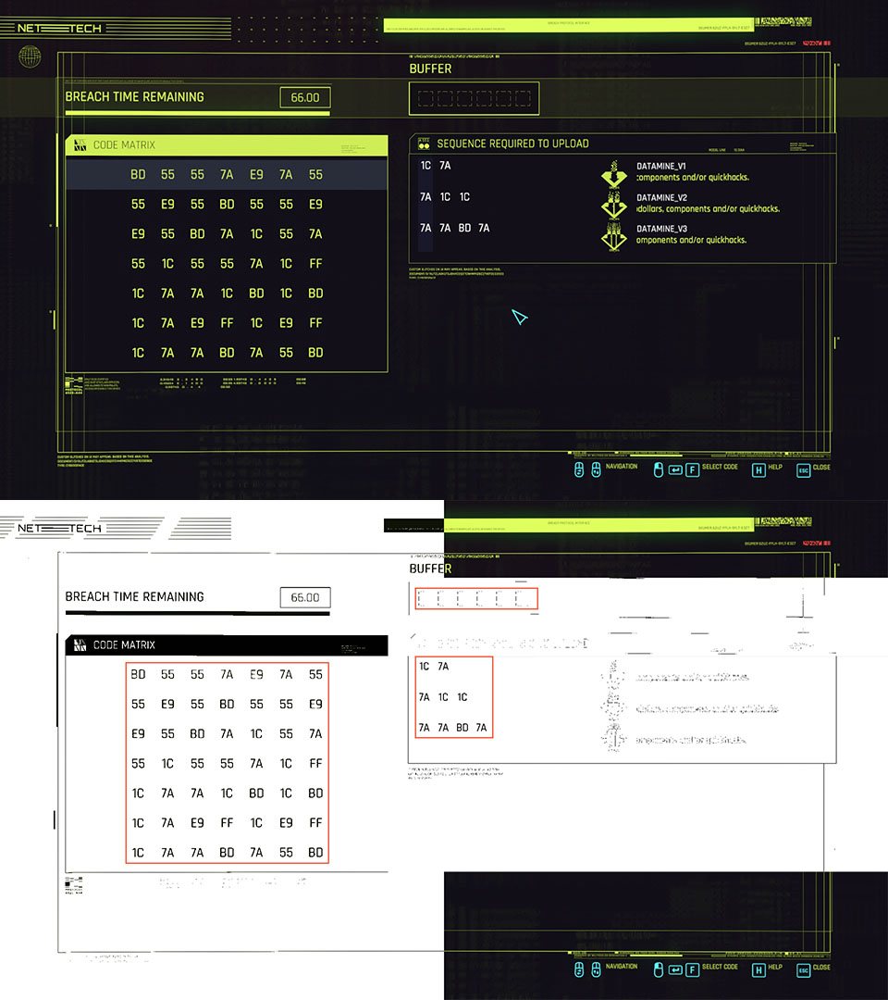
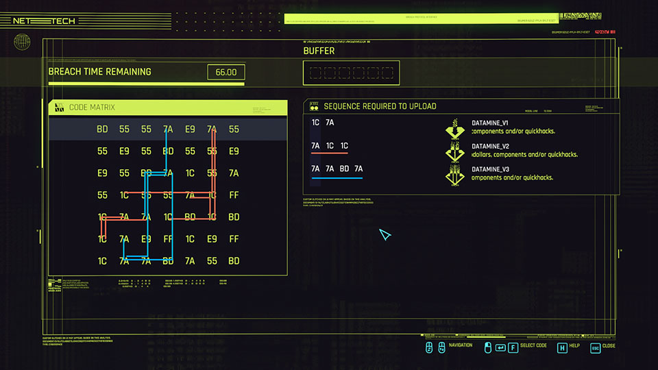
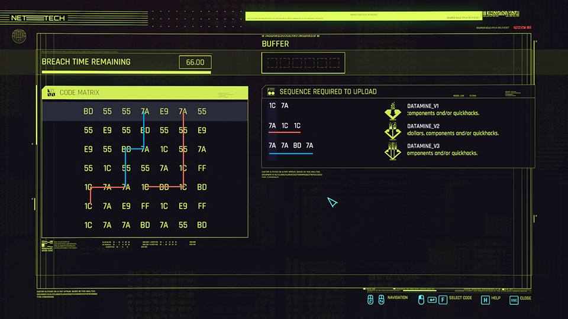

# CyberBot 2077

Bot, who solves breach protocol games from Cyberpunk 2077.


## Usage

- [Download](#download) or [build](#build) the bot
- Launch `cyberbot2077.exe`
- Launch a breach protocol game
- Move mouse cursor away. It must not obstruct the game field
- Press `PrintScreen` (or `Alt + PrintScreen` in window mode) keyboard button
- Wait a second
- ???
- PROFIT

> Bot may consume `bmp` image path as last command line argument to print all possible solutions
> ```
> cyberbot2077.exe path/to/image.bmp
> ```

## How it works

`PrintScreen` keyboard button triggers the bot, and it grabs screenshot
to recognize game field (matrix, conditions, buffer size and screen coordinates).



```
Matrix:
0xbd 0x55 0x55 0x7a 0xe9 0x7a 0x55
0x55 0xe9 0x55 0xbd 0x55 0x55 0xe9
0xe9 0x55 0xbd 0x7a 0x1c 0x55 0x7a
0x55 0x1c 0x55 0x55 0x7a 0x1c 0xff
0x1c 0x7a 0x7a 0x1c 0xbd 0x1c 0xbd
0x1c 0x7a 0xe9 0xff 0x1c 0xe9 0xff
0x1c 0x7a 0x7a 0xbd 0x7a 0x55 0xbd

Conditions:
0x1c 0x7a
0x7a 0x1c 0x1c
0x7a 0x7a 0xbd 0x7a

Steps: 6
```

Then bot finds all solutions for each condition



Tries to merge solutions together to cover as many conditions as possible:
- One solution may be small piece of other
- Ending of one solution may be beginning of other
- 1-3 additional steps are required to merge them
- ...

Then all merged solutions must be finalized:
first step is always vertical and contains any top item.

Current example has 303 completed solutions.
Bot filters the shortest solutions and applies solution,
which covers as many conditions as possible (last conditions have greater score).



```
Found 303 solutions
6 best solutions:
Solution #1, conditions: ✔ ✖ ✖, steps: 0xe9 0x1c 0x7a
Solution #2, conditions: ✖ ✔ ✖, steps: 0x7a 0x1c 0x1c
Solution #3, conditions: ✖ ✖ ✔, steps: 0x7a 0x7a 0xbd 0x7a
Solution #4, conditions: ✔ ✔ ✖, steps: 0x7a 0x1c 0x1c 0x7a
Solution #5, conditions: ✔ ✖ ✔, steps: 0x55 0x1c 0x7a 0x7a 0xbd 0x7a
Solution #6, conditions: ✖ ✔ ✔, steps: 0x7a 0x7a 0xbd 0x7a 0x1c 0x1c
```

Last solution `#6` will be applied.

## Download

Download bot [here](https://github.com/ricorodriges/cyberbot2077/releases).

Then run `cyberbot2077.exe` and enjoy!

## Build

You may run tests to make sure everything is ok
```sh
cargo test
```

And build as usual rust crate
```sh
cargo build --release
./target/release/cyberbot2077.exe
```